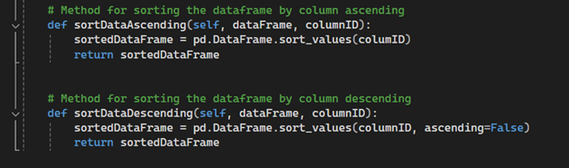

## Portfolio Purpose

The purpose of this project was to showcase skills that I have learned while completing my Bachelor's in Computer Science. I was tasked with making three separate updates to projects completed in previous courses. I chose to take one project and upgrade it for each category rather than picking a new project for each category. I did this because I wanted to show how different the same project completed at an early stage of my degree would be if I did it now. Originally, I planned to accomplish this by rewriting this project into a standalone web application. I was not able to complete this goal due to personal time constraints, but I was able to make three updates that improved the program in meaningful ways. 

## Chosen Artifact

As mentioned above, I have chosen to make multiple updates to one artifact rather than using a few artifacts. The artifact I chose to use was my project from CS-340. In this course, I was tasked with creating an application for Grazios Salvare, an organization that trains rescue animals. The application was to take a database of animals and display them in a dataframe. I was also provided with a list of criteria that are considered when animals are selected for different types of rescue. The client wanted each of these types of rescue to be an option when sorting the dataframe. When one of these options is selected, the dataframe needs to be filtered and only show animals that match the specified criteria. The client also requested that a map and a graph be added. The map would show the location of any selected animals so the user can see how far away the animal is. The graph was made to show the distribution of animals that were currently shown in the dataframe. I was able to complete all of this in the original project, but I wanted to go back over this and see what I may do differently now that I have more experience.

* * *

## Category 1: Software Engineering and Design

* * *

With this update, I aim to show how I have grown as a software engineer by evolving the existing code into a more complete and polished project. The original code was tested by running the site and manually navigating through the site to the module that you are trying to test. This is not a good way to ensure code is working, as the server had to be restarted every time an update was made. To address this, I wanted to make a test module that would ensure each function was working properly before the code was run. I wrote a basic test module that, when run, writes the return value of each test to the console so it is easy to see which test is failing and why. 

This image shows the test method for updating the database. The first test shows what happens when the database contains an entry that matches your search. The second line shows what happens when your search returns no items to update. 

This image shows the test method for deleting items from the database. Again, the first line shows what the result is when the database contains items that match your search. The second line shows what happens when your search returns no items.

* * *

## Category 2: Algorithms and Data Structures

* * *

For this category, I only had one data structure to work with. I have a dataframe that displays the list of animals from the database. I decided to show my skills by making the dataframe reorganizable by column. I wanted the dataframe to be organized by every column by simply clicking the column title. The code will first get the column ID of the chosen column and then check it against a variable that will hold the last clicked column ID. If the variable is empty, meaning this is the first column chosen, the code saves the ID into the variable and adds 1 to an integer used to track how many times a column has been clicked. If the column ID matches, variable 1 is added to the integer. If the column ID does not match the variable, the column ID is saved over the variable, and the integer is set to 0 before having 1 added to it. Now, the code will call one of the functions based on the integer value. If the integer is odd, the sort ascending function will be called, and if the integer is even, the sort descending function will be called. This will allow users to sort the data, switching between ascending and descending as many times as they want.

* * *

## Category Three: Databases

* * *

The original project already worked with a database, but the functions that I built were very basic. The original artifact took a dictionary and inserted it into the database, never confirming any information. This can cause some major problems, so I reworked the code to not only verify that the information is an appropriate size, but that any important information is present before adding the animal. Rather than just checking if the dictionary is empty or not, I set up a function that checks each of the customer-identified important sections. This function verifies that the required information is entered and the size of the data. Finall,y I also added a step to verify that the animal's ID is unique, so there are no instances of multiple animals with the same ID.
